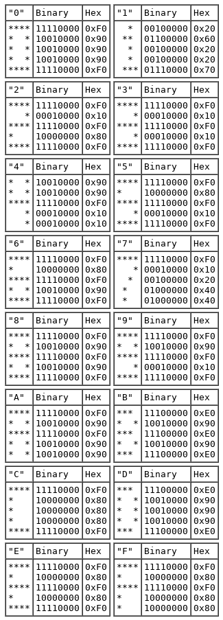

# 2.4 ディスプレイ

最初のChip-8実装では64x32ピクセルのモノクロディプレイが使われた。

ETI660等のインタプリタでは64x48や64x64ピクセルモードもあるらしいが、私の知る限り、それらのモードをサポートするChip-8実装は今のところない。最近ではSuper Chip-48というHP48計算機のインタプリタが128x64ピクセルモードを備えているそうだ。

Chip-8はスプライトを使ってスクリーン上に描画を行う。スプライトはバイト列で描画したい対象のバイナリ表現である。Chip-8のスプライトは15バイトまで可能でそのサイズは8x15になる。

Chip-8のプログラムは0からFまでの文字を表すスプライトのプリセットを使用することができる。それらは5バイト長で8x5ピクセルで、インタプリタのメモリの(0x000から0x1FF)に格納されている。

